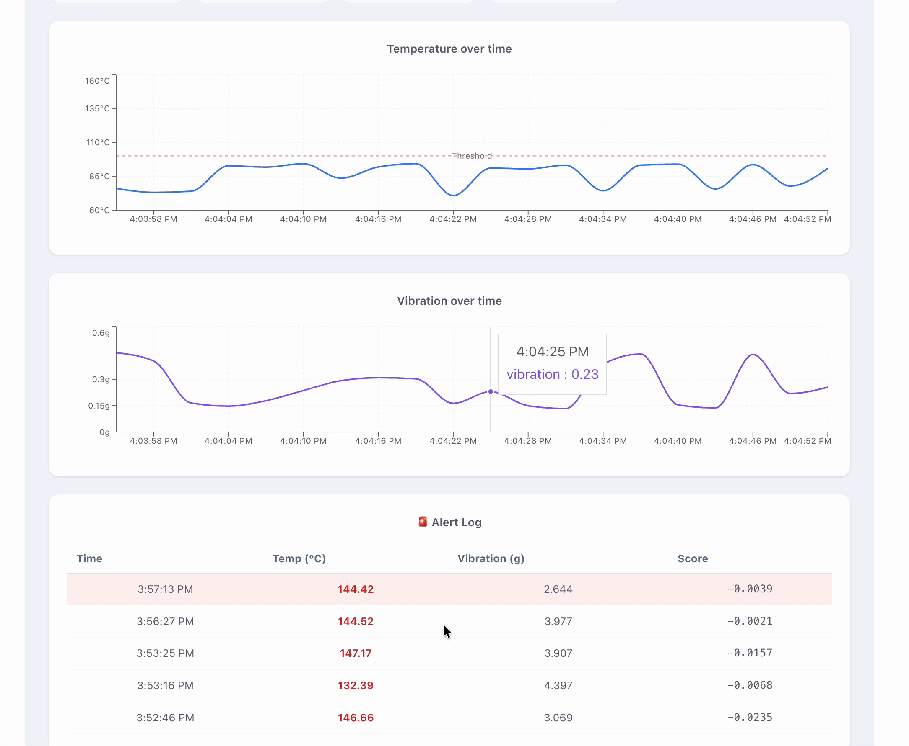

``s`markdown
# ⚙️ Predictive Maintenance MLOps Pipeline

An enterprise-grade, end-to-end MLOps system that detects industrial machine anomalies in real time using IoT sensors, machine learning, and a full cloud deployment on Azure.



> **Live API:** http://predmaintapi3.eastus.azurecontainer.io/health

---

## 📌 Project Overview

This system simulates a factory floor where machines emit sensor telemetry (temperature, vibration, pressure, RPM). An **Isolation Forest** ML model detects anomalies in real time. The entire pipeline — from data ingestion to live dashboard — is containerized, deployed to Azure, and monitored for data drift.

---

## 🏗️ Architecture

```
IoT Simulator (Python)
        │
        ▼
Azure IoT Hub → Stream Analytics → Azure Blob Storage
        │
        ▼
Azure Databricks (PySpark — clean, normalize, feature engineer)
        │
        ▼
Azure Machine Learning (Isolation Forest — train + register)
        │
        ▼
Docker Container → Azure Container Registry
        │
        ▼
Azure Container Instances (live REST API)
        │
        ▼
React Dashboard (real-time anomaly alerts)
        ▲
        │
GitHub Actions CI/CD + Evidently AI Drift Monitor
```

---

## 🎯 Key Features

- **Real-time anomaly detection** — Isolation Forest model detects machine failures before they happen
- **Live dashboard** — React app polling Azure API every 3 seconds with temperature and vibration charts
- **Automated CI/CD** — GitHub Actions builds, tests, and deploys on every push
- **Data drift monitoring** — KS-test detects when production data shifts from training distribution
- **Containerized deployment** — Docker image running on Azure Container Instances
- **Zero-downtime** — 2-replica Kubernetes-ready deployment manifest included

---

## 🛠️ Tech Stack

| Layer | Technology |
|---|---|
| IoT Simulation | Python, Azure IoT Device SDK |
| Cloud Ingestion | Azure IoT Hub, Stream Analytics |
| Data Engineering | Azure Databricks, PySpark, Delta Lake |
| ML Model | Isolation Forest (scikit-learn), MLflow |
| Inference API | FastAPI, Uvicorn |
| Containerization | Docker (linux/amd64) |
| Cloud Deployment | Azure Container Instances, Azure Container Registry |
| CI/CD | GitHub Actions (3-stage: test → build → deploy) |
| Drift Monitoring | SciPy KS-test, Evidently AI |
| Dashboard | React, Recharts, Vite |

---

## 📁 Project Structure

```
predictive-maintenance-mlops/
├── iot_simulator/
│   └── device_simulator.py       # IoT sensor simulator (local + Azure mode)
├── ml/
│   ├── train.py                  # Isolation Forest training + feature engineering
│   ├── api.py                    # FastAPI inference microservice
│   └── score.py                  # AzureML scoring script
├── monitoring/
│   ├── drift_monitor.py          # KS-test drift detection + auto-retraining trigger
│   └── reports/                  # Auto-generated drift reports
├── dashboard/
│   └── src/App.jsx               # React real-time dashboard
├── k8s/
│   └── deployment.yaml           # Kubernetes deployment manifest (AKS-ready)
├── tests/
│   └── test_api.py               # pytest API test suite (5 tests)
├── docs/
│   ├── screenshots/
│   │   ├── dashboard-live.png
│   │   └── dashboard-anomaly-detection.gif
│   └── demo/
│       └── dashboard-demo.mov
├── .github/
│   └── workflows/
│       └── deploy.yml            # CI/CD pipeline
├── Dockerfile
├── requirements.txt
└── README.md
```

---

## 🚀 Quick Start

### Prerequisites
- Python 3.11+
- Node.js 18+
- Docker Desktop

### 1. Clone the repo
```bash
git clone https://github.com/Saumil-1012/predictive-maintenance-mlops.git
cd predictive-maintenance-mlops
```

### 2. Set up Python environment
```bash
python3.11 -m venv venv
source venv/bin/activate
python -m pip install -r requirements.txt
```

### 3. Generate sensor data
```bash
python iot_simulator/device_simulator.py
# Let it run for 1-2 minutes, then Ctrl+C
```

### 4. Train the model
```bash
python ml/train.py
```

Output:
```
✅ True Positives  (caught real anomalies):   2
❌ False Positives (normal flagged):          1
⚠️  False Negatives (missed anomalies):        0
✅ Training complete!
```

### 5. Start the API
```bash
uvicorn ml.api:app --reload --port 8000
```

### 6. Start the dashboard
```bash
cd dashboard && npm install && npm run dev
# Open http://localhost:5173
```

### 7. Run drift monitoring
```bash
python monitoring/drift_monitor.py
```

### 8. Run tests
```bash
pytest tests/ -v
```

### 9. Build Docker image
```bash
docker build -t pred-maint:latest .
docker run -p 8000:8000 pred-maint:latest
```

---

## 🌐 Live API

**Base URL:** `http://predmaintapi3.eastus.azurecontainer.io`

### Endpoints

| Method | Endpoint | Description |
|---|---|---|
| GET | `/health` | Health check |
| GET | `/status` | Live simulated reading with prediction |
| POST | `/predict` | Run anomaly detection on sensor data |

### Example — Normal reading
```bash
curl -X POST http://predmaintapi3.eastus.azurecontainer.io/predict \
  -H "Content-Type: application/json" \
  -d '{
    "device_id": "machine-001",
    "temperature_c": 82.5,
    "vibration_g": 0.3,
    "pressure_bar": 104.2,
    "rpm": 2980.0
  }'
```

Response:
```json
{
  "device_id": "machine-001",
  "is_anomaly": false,
  "anomaly_score": 0.2442,
  "alert_level": "OK"
}
```

### Example — Anomaly detected
```bash
curl -X POST http://predmaintapi3.eastus.azurecontainer.io/predict \
  -H "Content-Type: application/json" \
  -d '{
    "device_id": "machine-001",
    "temperature_c": 142.0,
    "vibration_g": 3.8,
    "pressure_bar": 104.2,
    "rpm": 2980.0
  }'
```

Response:
```json
{
  "device_id": "machine-001",
  "is_anomaly": true,
  "anomaly_score": -0.0019,
  "alert_level": "CRITICAL"
}
```

---

## 🤖 ML Model

**Algorithm:** Isolation Forest (unsupervised anomaly detection)

**Why Isolation Forest?**
- No labeled data needed — learns normal behavior and flags outliers
- Scales well to high-dimensional sensor data
- Fast inference — suitable for real-time prediction

**Features used:**
| Feature | Description |
|---|---|
| `temperature_c` | Machine temperature in Celsius |
| `vibration_g` | Vibration in g-force |
| `pressure_bar` | Pressure in bar |
| `rpm` | Rotations per minute |
| `temp_rolling_avg` | 5-reading rolling average of temperature |
| `vib_rolling_avg` | 5-reading rolling average of vibration |
| `temp_delta` | Rate of change in temperature |
| `vib_delta` | Rate of change in vibration |

**Training results (49 readings):**
- ✅ 2/2 real anomalies detected
- ✅ 0 missed anomalies (false negatives)
- ⚠️ 1 false positive (improves with more data)

---

## 🔄 CI/CD Pipeline

Every push to `main` triggers:

```
Push to main
     │
     ▼
┌─────────┐     ┌─────────┐     ┌──────────┐
│  test   │────▶│  build  │────▶│  deploy  │
│  28s    │     │  1m13s  │     │   6s     │
└─────────┘     └─────────┘     └──────────┘
  pytest +        docker          kubectl /
  train model     build +         ACI deploy
  API tests       verify health
```

**All 3 jobs passing ✅**

---

## 📊 Drift Monitoring

The drift monitor runs the **Kolmogorov-Smirnov test** on each feature column:

```
Scenario 1 — Normal production:
  ✅ temperature_c   p=0.2737  shift=-0.41°C
  ✅ vibration_g     p=0.6145  shift=-0.11g
  ✅ pressure_bar    p=0.4977  shift=-0.57 bar
  ✅ rpm             p=0.0322  shift=+25 rpm
  → No drift — model healthy

Scenario 2 — Drifted production:
  🚨 temperature_c   p=0.0000  shift=+28.76°C
  🚨 vibration_g     p=0.0000  shift=+0.78g
  🚨 pressure_bar    p=0.0000  shift=+8.87 bar
  🚨 rpm             p=0.0000  shift=+263 rpm
  → DRIFT DETECTED — retraining triggered
```

---

## ☁️ Azure Deployment

```bash
# Resources created
az group create --name pred-maint-rg --location eastus
az acr create --name predmaintacr --sku Basic
az storage account create --name predmaintstorage

# Build and push image (AMD64 for Azure)
docker buildx build --platform linux/amd64 \
  -t predmaintacr.azurecr.io/pred-maint:latest --push .

# Deploy to Azure Container Instances
az container create \
  --name predmaintapi3 \
  --resource-group pred-maint-rg \
  --image predmaintacr.azurecr.io/pred-maint:latest \
  --dns-name-label predmaintapi3 \
  --ports 80 --cpu 1 --memory 1.5 \
  --location eastus

```

---

## ⚠️ Important — Azure Resources

To avoid charges, delete all resources when not in use:

```bash
az group delete --name pred-maint-rg --yes
```

---
## 🔗 Industry Parallels

The architecture patterns used in this project directly map to enterprise ML platforms:

| This Project | Enterprise Equivalent |
|---|---|
| Azure IoT Hub | SAP IoT, AWS IoT Core |
| Azure Databricks | SAP Datasphere, Databricks on AWS |
| Azure Machine Learning | SAP AI Core, AWS SageMaker |
| Azure Container Instances | SAP AI Core Serving, AWS ECS |
| GitHub Actions CI/CD | SAP Continuous Delivery, Jenkins |
| Evidently Drift Monitor | SAP AI Core Monitoring, Fiddler AI |


## 👨‍💻 Author

**Saumilkumar savani** — TU Munich, campus heilbronn  
Advanced Machine Learning Project  
Azure MLOps Predictive Maintenance Pipeline

---

## 📄 License

MIT License — free to use for educational purposes.
```
